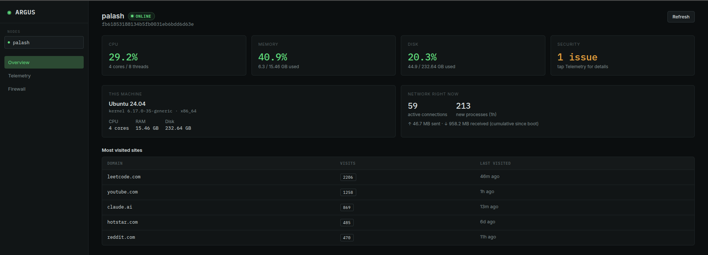
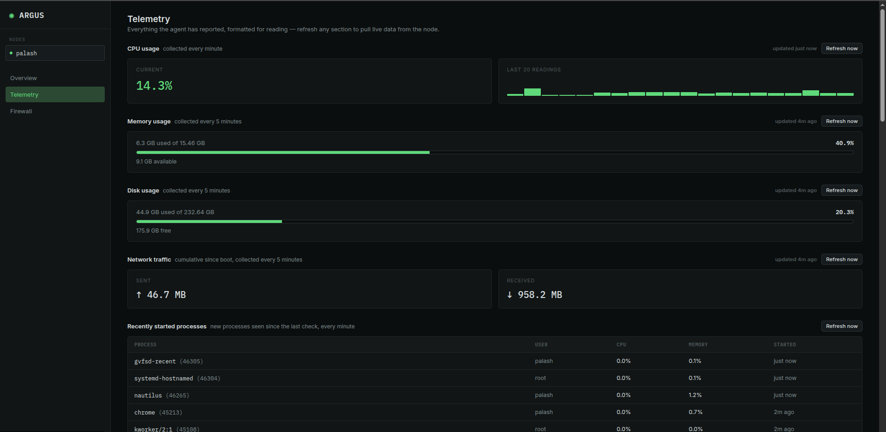
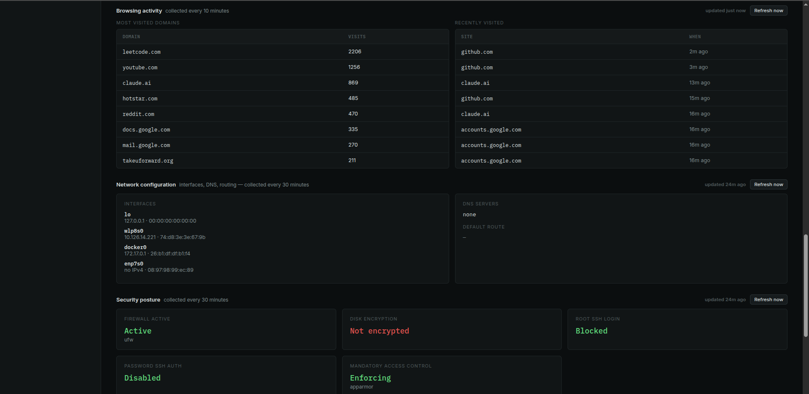
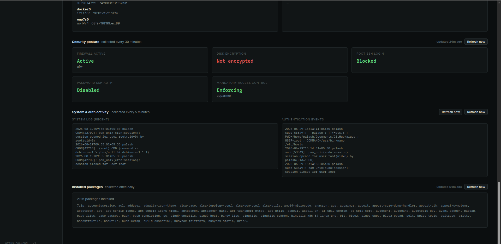
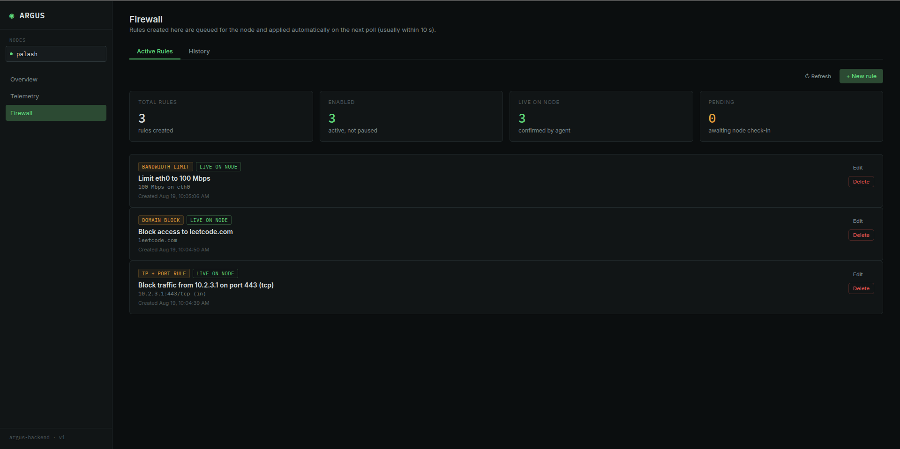
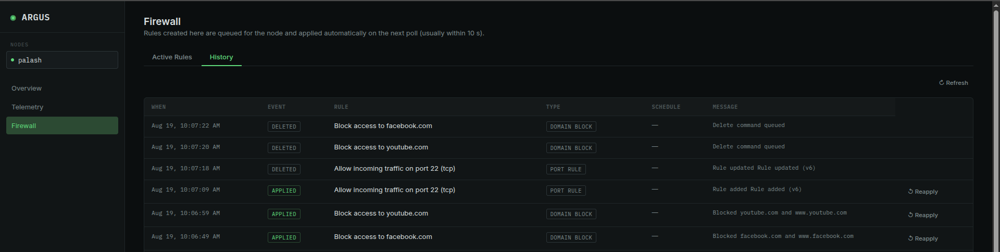
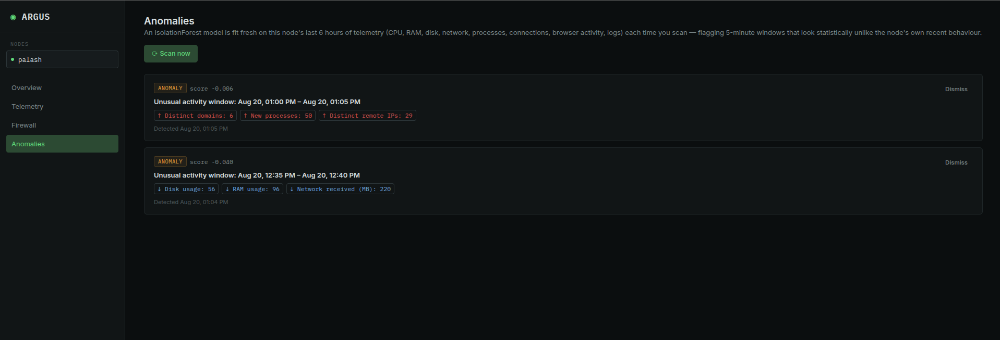

# Argus

**A centralized endpoint monitoring and management system for Linux fleets.**

Argus lets you enroll Linux machines, watch their live telemetry (CPU, RAM,
disk, network, processes, browser history, security posture), push firewall
rules to them, run remote commands, and catch anomalous network behavior —
all from a single web dashboard.

Built as a Major Project / Colloquium submission at **ABV-IIITM Gwalior**
(Information Technology), under the supervision of **Prof. Aditya Trivedi**.



---

## Table of Contents

- [Overview](#overview)
- [Features](#features)
- [Screenshots](#screenshots)
- [Architecture](#architecture)
- [Tech Stack](#tech-stack)
- [Project Structure](#project-structure)
- [Getting Started](#getting-started)
- [API Reference](#api-reference)
- [Security Design](#security-design)
- [Scope & Design Decisions](#scope--design-decisions)
- 
---

## Overview

Argus is made up of three independent components:

| Component | Description |
|---|---|
| **Backend** | FastAPI + PostgreSQL server. Owns all state, all intelligence, and all APIs — both for agents pushing telemetry and for the dashboard reading it. |
| **Agent** | A lightweight Python service that runs on each monitored Linux machine. Collects telemetry on independent schedules, enforces firewall/command instructions, and polls the backend for work. |
| **Frontend** | A React admin dashboard for viewing fleet-wide telemetry, managing firewall rules, issuing commands, and reviewing detected anomalies. |

A core design principle: **agents never listen for inbound connections.**
Every agent only pushes data out and polls the backend for pending commands,
so nodes behind NAT or without any open inbound ports work out of the box.
All decision-making — anomaly detection, command dispatch, rule state — lives
centrally on the server, keeping the agent itself as simple as possible.

---

## Features

- **Fleet telemetry** — CPU, RAM, disk, network I/O, active connections, running
  processes, installed packages, startup programs, OS/hardware info, browser
  history (Chrome, Brave, Edge, Chromium, Firefox), recent logs, and auth events,
  each collected on its own interval (1 min for CPU/processes, up to daily for
  OS/hardware/packages).
- **Remote firewall management** — create/edit/delete firewall rules from the
  dashboard, with time-window scheduling, applied to nodes via `iptables`, with
  full apply-history tracking.
- **Remote command execution** — queue commands for a node from the dashboard;
  the agent's poller doubles as a heartbeat, so node online/offline status is
  always current.
- **ML-based anomaly detection** — an unsupervised `IsolationForest` model
  flags unusual network-connection patterns per node, with anomalies surfaced
  and dismissible from the dashboard.
- **Security-conscious enrollment** — single-use, high-entropy enrollment
  tokens for onboarding new nodes; SHA-256-hashed API keys for ongoing agent
  authentication.

---

## Screenshots

**Live Telemetry**





**Firewall Management**




**Anomaly Detection**



---

## Architecture

```
┌─────────────┐        pushes telemetry        ┌──────────────────┐        reads/writes        ┌──────────────┐
│   Agent(s)  │ ──────────────────────────────► │      Backend      │ ◄────────────────────────► │   Frontend    │
│  (Linux     │ ◄────────────────────────────── │  FastAPI + Postgres│                            │  React Admin  │
│   nodes)    │        polls for commands        │  (all intelligence)│                            │   Dashboard   │
└─────────────┘                                   └──────────────────┘                            └──────────────┘
```

- Agents authenticate with a **Bearer API key** issued at registration and
  poll for commands / firewall updates every 10 seconds.
- The backend is the single source of truth — no logic runs on the agent
  beyond collection, local enforcement, and reporting back status.
- The frontend talks only to the backend's REST API; it has no direct
  visibility into agents.

---

## Tech Stack

| Layer | Technologies |
|---|---|
| Backend | Python, FastAPI, PostgreSQL, SQLAlchemy, scikit-learn (IsolationForest) |
| Agent | Python, `schedule`, systemd (hardened service), `iptables` |
| Frontend | React 19, React Router, Vite, Tailwind CSS |

---

## Project Structure

```
argus/
├── backend/            # FastAPI server
│   ├── app/
│   │   ├── models/     # SQLAlchemy models (nodes, telemetry, firewall, anomalies...)
│   │   ├── routers/     # API endpoints (telemetry, firewall, commands, anomaly, register)
│   │   ├── schemas/     # Pydantic request/response schemas
│   │   ├── services/    # Anomaly detection (IsolationForest)
│   │   └── core/        # Auth, security (API key hashing)
│   ├── init_db.py
│   ├── generate_token.py
│   └── seed_anomaly_demo_data.py
├── agent/               # Runs on each monitored Linux machine
│   ├── collectors/      # Per-function telemetry collectors (resource_usage, process, network, security, system_profile, logs)
│   ├── enforcement/      # Firewall/iptables, hosts, bandwidth enforcement + scheduler
│   ├── command_poll/     # Command polling / heartbeat
│   ├── registration/     # First-boot registration flow
│   └── transport/        # HTTP client to backend
├── frontend/             # React admin dashboard
│   └── src/pages/         # Overview, Dashboard, Nodes, Telemetry, Firewall, Commands, Anomalies
├── assets/               # Screenshots (used in this README)
├── setup.md              # Full local setup walkthrough
└── API_REFERENCE.md       # Runnable curl examples for every live endpoint
```

---

## Getting Started

Three components, three terminals — backend first, then the agent, then the
frontend.

```bash
# 1. Backend
cd backend
python3 -m venv venv && source venv/bin/activate
pip install -r requirements.txt
# create backend/.env with DATABASE_URL=postgresql://<user>:<password>@localhost/argus
python init_db.py
python generate_token.py          # prints an enrollment token
fastapi dev app/main.py           # → http://127.0.0.1:8000

# 2. Agent (on the machine to monitor, needs root)
cd agent
python3 -m venv venv && source venv/bin/activate
pip install -r requirements.txt
# create agent/.env with ARGUS_SERVER_URL and ARGUS_ENROLLMENT_TOKEN
sudo venv/bin/python3 agent.py

# 3. Frontend
cd frontend
npm install
npm run dev                        # → http://localhost:5173
```

Full walkthrough, including anomaly-detection demo seeding and a sanity-check
checklist, is in **[`setup.md`](setup.md)**.

---

## API Reference

Every live endpoint — registration, telemetry ingest/read, firewall CRUD,
command queue, anomaly detection — is documented with runnable `curl`
examples in **[`API_REFERENCE.md`](API_REFERENCE.md)**. Interactive Swagger
docs are also available at `/docs` once the backend is running.

---

## Security Design

- **Enrollment tokens** are single-use, admin-generated, high-entropy plain
  strings — sufficient on their own without hashing, unlike low-entropy
  passwords.
- **Agent API keys** are SHA-256-hashed server-side; the raw key is shown
  exactly once, at registration.
- Agents make **no inbound connections** — they only push data and poll,
  so no ports need to be opened on monitored machines.

---

## Scope & Design Decisions

Argus is built as a functional demo prototype alongside an academic
submission, so scope is deliberately bounded:

- Anomaly detection uses a single unsupervised `IsolationForest` fit per
  scan (not persisted, no per-node models) — kept intentionally minimal and
  architecturally defensible rather than over-engineered for a demo.
- Multi-user RBAC, automated test suites, notifications, and deployment
  polish were consciously left out of scope in favor of a complete,
  working core system.

---

GitHub: [@PalashChitnavis](https://github.com/PalashChitnavis)
Repository: [github.com/PalashChitnavis/argus](https://github.com/PalashChitnavis/argus)
